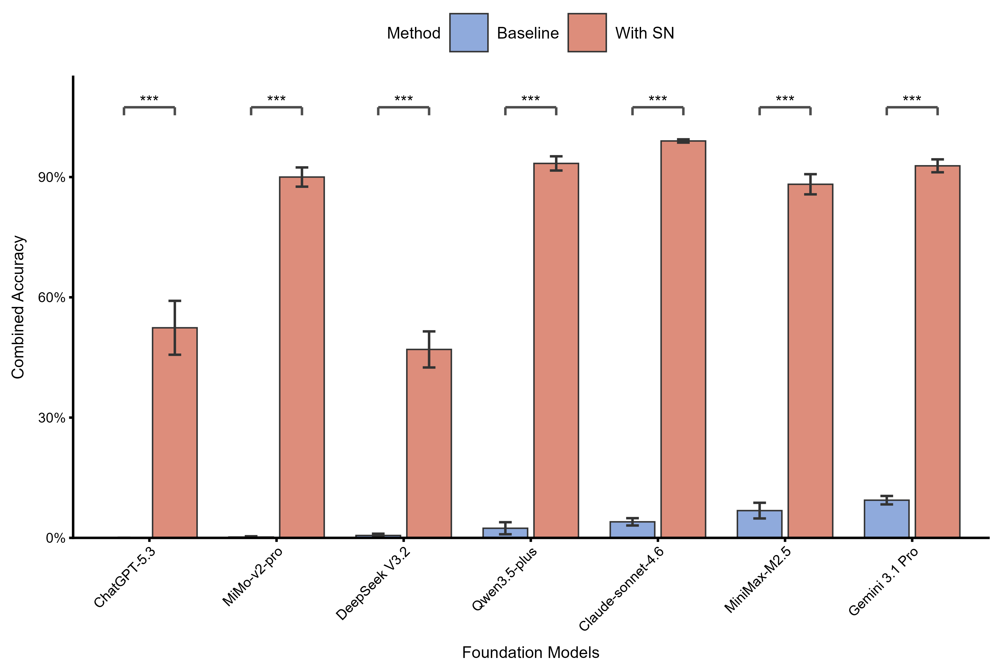
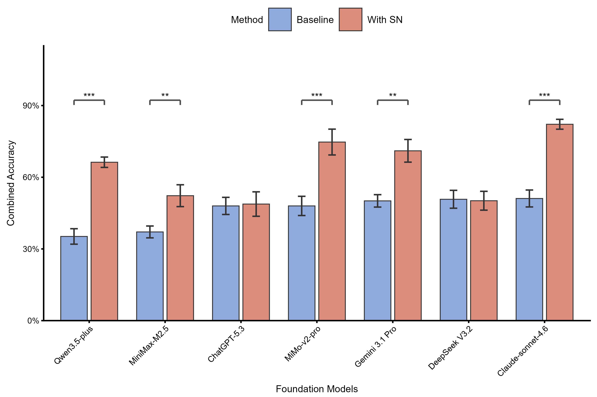
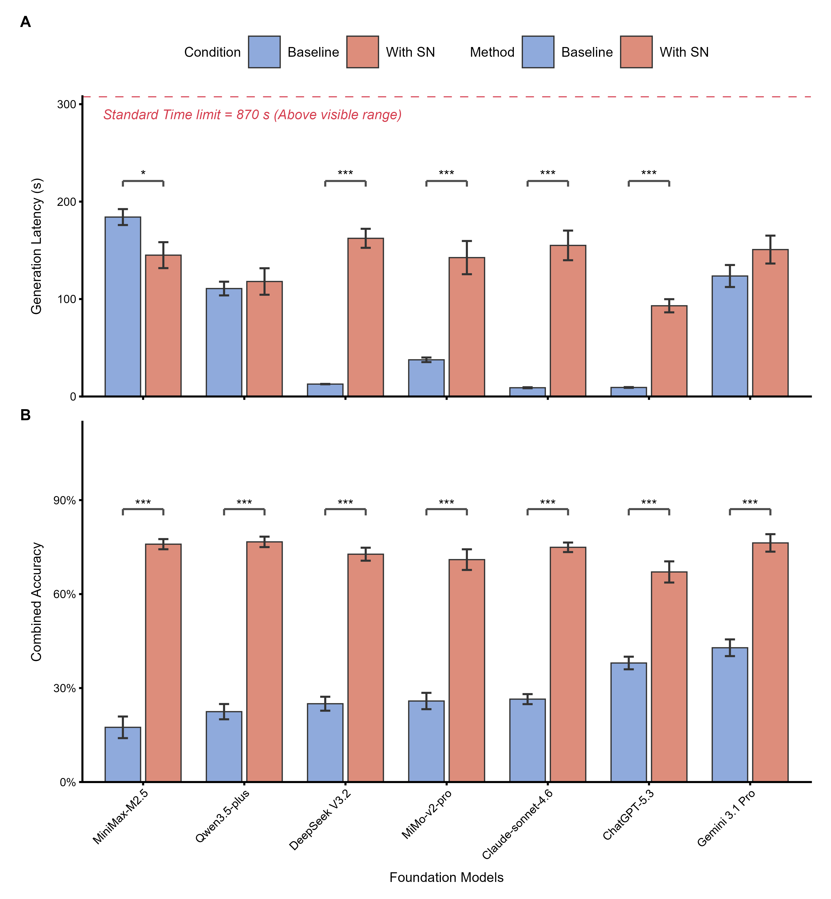

# Scholar Navis

**A Privacy-First Scientific Discovery Engine Powered by Localized Retrieval-Augmented Generation (RAG) and Academic Agent Tools**

Scholar Navis is a native desktop research engine engineered specifically for computational biology and molecular plant sciences. Designed to circumvent the critical cognitive bottleneck induced by the exponential growth of multi-omics data, this system integrates Retrieval-Augmented Generation (RAG) with specialized academic agent tools (including the Model Context Protocol [MCP] and customizable SKILLs).

Scholar Navis fundamentally resolves the pervasive "hallucination" and "knowledge conflict" phenomena inherent in Large Language Models (LLMs). By orchestrating a paradigm shift from an "opaque end-to-end generator" to a "transparent and traceable scientific reasoning scaffold," the framework ensures that all synthetic outputs are strictly anchored to verified local literature pools and authoritative biological databases.

-----

## 🏗️ System Architecture

The Scholar Navis framework operates through three rigorously engineered layers, orchestrated by a native Qt Event Bus to construct a high-fidelity data processing pipeline:

### Layer 1: Secure Data Ingestion and Vectorization

Establishing a highly secure, dual-path pipeline to guarantee absolute data privacy for unpublished or sensitive research. The persistent data path independently processes local PDF manuscripts utilizing hardware-accelerated ONNX vectorization into a localized ChromaDB instance, effectively isolating core intellectual property. Concurrently, a transient path facilitates the seamless integration of journal RSS feeds and temporary text inputs.

### Layer 2: Logical Orchestration and Inference

To mitigate linguistic and pre-training corpus biases, user inputs undergo automated language detection and are pre-translated into English. Standardized queries are processed via ChromaDB vector search and refined by local Reranker scoring. Crucially, before being dispatched to the LLM, the context is dynamically augmented through in-context prompting, strictly defined JSON schema injection, and the execution of academic agent tools (MCP and SKILLs), enforcing objective factual constraints.

### Layer 3: Dynamic Output Rendering and Interaction

Utilizing real-time regular expression (regex) parsing, this layer constructs a highly interactive academic interface. Specialized biological identifiers (e.g., NCBI TaxID, PubChem CID) are dynamically transformed into actionable hyperlinks. A dedicated "Cited Sources" module ensures rigorous citation tracking, while multidimensional heuristic follow-up prompts are generated to augment lateral scientific exploration.

-----

## 🚀 Core Capabilities & Performance Benchmarks

Scholar Navis rigorously addresses the latency-accuracy trade-off and the inherent parametric biases of highly conversational foundation models.

### 1\. Deep Hallucination Mitigation in Literature Retrieval

General-purpose LLMs frequently exhibit severe citation hallucinations, acting as autoregressive sequence predictors that prioritize fluent but flawed parametric memory. Scholar Navis utilizes strict source confinement to sever these unreliable inference paths.

**Performance:** Quantitative evaluations indicate that standalone foundation models yield literature retrieval accuracies below 10%. Integration with the Scholar Navis localized RAG and MCP architecture effectively eliminates fabricated references, significantly elevating the retrieval accuracy of top-tier model combinations (e.g., powered by Claude-sonnet-4.6, Qwen3.5-plus) to over 90% ($P \le 0.001$).

### 2\. High-Precision Biological Entity Extraction

By directing queries through MCP to authoritative databases, the framework forces the LLM's inference logic to strictly anchor onto high-fidelity biological metadata (e.g., exact amino acid sequences, interacting protein networks) prior to output generation.

**Performance:** The extraction precision for complex biological entities is significantly enhanced from a baseline of 30%–60% to a robust 60%–90%. The system notably resolves the "knowledge conflict" for highly instruction-compliant models by suppressing their ungrounded parametric memory.

### 3\. Resolving the Latency-Accuracy Trade-off

Scholar Navis empowers researchers to seamlessly synthesize critical evidence across disparate sources, drastically compressing the information acquisition cycle while guaranteeing absolute scientific rigor.

**Performance:** In end-to-end simulations of complex information-gathering tasks, traditional manual workflows required approximately 870 seconds. While standalone models are fast, their data is scientifically unreliable. Scholar Navis achieves a pragmatic equilibrium, securing highly accurate biological data in a fraction of the manual curation time without introducing statistically significant latency for optimized models.

-----

## 🔒 Data Privacy and Hardware-Bound Security

Given the extreme sensitivity of pre-published biological data, Scholar Navis is engineered with stringent security protocols:

  * **Absolute Local Processing:** All sensitive operations, including PDF parsing, embedding vector construction, and Reranker semantic filtering, are executed strictly offline on local hardware.
  * **Air-Gapping Capability:** External network requests are initiated strictly under explicit user authorization. For highly confidential institutional research, users can deploy fully localized, non-networked open-weight LLMs alongside self-hosted MCP/SKILL modules, achieving a genuinely air-gapped environment.
  * **Hardware-Bound Configuration Security:** All user configuration files (including API credentials) are encrypted utilizing OS-native security primitives and cryptographically bound to the unique hardware fingerprint of the host machine.

-----

## 📚 Integrated Authoritative Databases and References

Scholar Navis deeply integrates with a consortium of international biological and chemical databases via its dynamic academic agent architecture (MCP/SKILLs) to perform real-time fact-checking.

**When utilizing Scholar Navis for academic research, please ensure appropriate citation of the following foundational database resources that power the system's factual grounding:**

  * **NCBI:** Sayers, E.W., Beck, J., Bolton, E.E., et al. (2025). Database resources of the National Center for Biotechnology Information in 2025. *Nucleic Acids Res* 53:D20–d29.
  * **UniProt:** Consortium, T.U. (2024). UniProt: the Universal Protein Knowledgebase in 2025. *Nucleic Acids Research* 53:D609–D617.
  * **PubChem:** Kim, S., Chen, J., Cheng, T., et al. (2024). PubChem 2025 update. *Nucleic Acids Research* 53:D1516–D1525.
  * **RCSB PDB:** \* Berman, H.M., Westbrook, J., Feng, Z., et al. (2000). The Protein Data Bank. *Nucleic Acids Research* 28:235–242.
      * Burley, S.K., Bhatt, R., Bhikadiya, C., et al. (2024). Updated resources for exploring experimentally-determined PDB structures and Computed Structure Models at the RCSB Protein Data Bank. *Nucleic Acids Research* 53:D564–D574.
  * **STRINGdb:** von Mering, C., Jensen, L.J., Snel, B., et al. (2005). STRING: known and predicted protein-protein associations, integrated and transferred across organisms. *Nucleic Acids Res* 33:D433–437.
  * **Ensembl Plants:** Yates, A.D., Allen, J., Amode, R.M., et al. (2021). Ensembl Genomes 2022: an expanding genome resource for non-vertebrates. *Nucleic Acids Research* 50:D996–D1003.
  * **AlphaFold:** Jumper, J., Evans, R., Pritzel, A., et al. (2021). Highly accurate protein structure prediction with AlphaFold. *Nature* 596:583–589.
  * **KEGG:** Kanehisa, M., and Goto, S. (2000). KEGG: kyoto encyclopedia of genes and genomes. *Nucleic Acids Res* 28:27–30.
  * **ChEBI:** Degtyarenko, K., de Matos, P., Ennis, M., et al. (2007). ChEBI: a database and ontology for chemical entities of biological interest. *Nucleic Acids Research* 36:D344–D350.
  * **JASPAR:** Ovek Baydar, D., Rauluseviciute, I., Aronsen, D.R., et al. (2025). JASPAR 2026: expansion of transcription factor binding profiles and integration of deep learning models. *Nucleic Acids Research* 54:D184–D193.