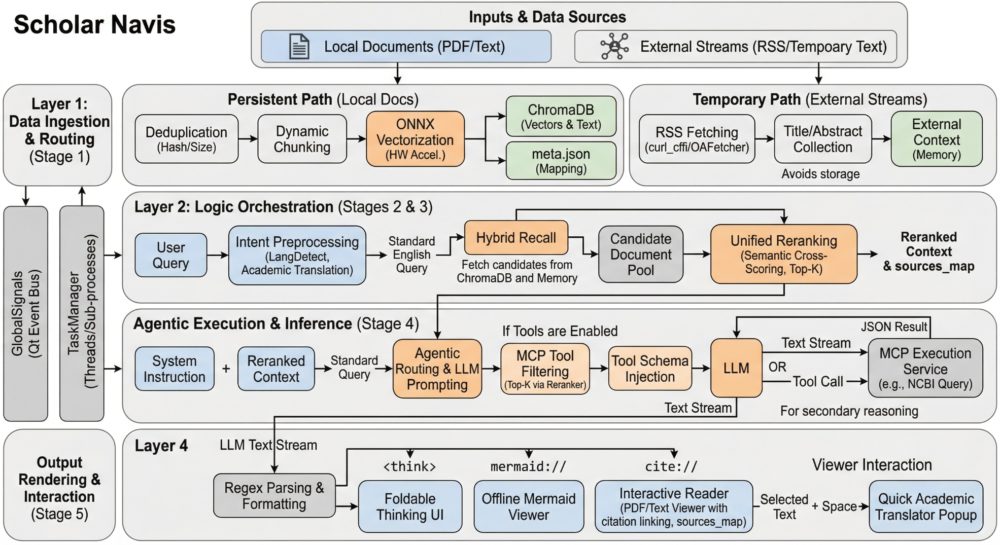

## 一、 系统执行摘要

Scholar Navis 是一个主要在本地客户端运行的学术文献处理系统。该系统整合了文档解析、向量化检索、大语言模型（LLM）对话编排以及外部订阅流（RSS）采集。系统采用了表现层与业务逻辑层分离的架构，通过多线程与子进程隔离繁重的计算任务，并实现了内部私有持久化数据与外部临时文本流的统一调度与处理。

------

## 二、 全链路处理流程与核心逻辑

系统在运行过程中，数据从输入到输出的生命周期可划分为以下五个标准处理阶段：

### 阶段 1：数据摄入与分类处理 (Data Ingestion & Routing)

系统对输入数据采取“持久化”与“临时化”双轨处理逻辑：

- **持久化路径（本地文献）：** 用户导入 PDF 或文本文件后，系统首先进行大小与哈希双重去重。随后，根据当前配置的模型上限进行动态切分（Dynamic Chunking），调用 ONNX Runtime（结合硬件加速）提取文本向量，最终将向量与文本片段写入 ChromaDB，并在 meta.json 中建立文件 UUID 与真实名称的映射。
- **临时化路径（外部订阅流）：** RSS 模块通过防屏蔽网络请求抓取线上文献的标题与摘要，并在后台异步嗅探 OA（Open Access）全文链接。当用户选择将这些 RSS 摘要发送至对话框时，系统**绕过向量化与 ChromaDB 存储**，直接将其作为“外部上下文（External Context）”暂存于内存中，避免了对本地知识库的污染。

### 阶段 2：意图预处理 (Intent Preprocessing)

- **语言自适应：** 当用户在 Chat 界面提交查询（Query）时，系统利用 langdetect 进行语言检测。若输入为非英语，系统会调用配置的翻译模型，通过预设的提示词（要求保留拉丁学名与专业术语）将其翻译为标准学术英语，以对齐英文为主的底层向量库。

### 阶段 3：混合召回与统一重排 (Hybrid Recall & Unified Reranking)

系统将来自不同渠道的信息进行合并与降噪：

- **初步召回：** 使用处理后的 Query 对 ChromaDB 发起向量检索，获取数十个相关的本地文档切片。
- **上下文合并：** 将上述本地文档切片，与内存中挂载的“临时化数据”（如用户勾选的 RSS 摘要集合、临时上传的纯文本）合并为一个候选文档池。
- **统一重排：** 将整个候选文档池与 Query 输入至独立的 Reranker（重排引擎）子进程中。Reranker 基于语义相关性进行交叉打分与排序，截取 Top-K 个片段，形成最终的高纯度上下文，并生成带有统一编号的 sources_map（来源映射表）。

### 阶段 4：智能体工具路由与执行 (Agentic Routing & MCP Execution)

若用户开启了联网/工具功能，系统会介入 MCP 协议层：

- **工具降维过滤：** 面对可能存在的数十个 MCP 工具，系统提取各工具的名称与描述，将其视为普通文本，**复用阶段 3 的 Reranker 模型**进行相关性打分。仅保留得分最高的少数工具（Top-K），将其 Schema 注入给 LLM，防止超出 Token 限制。
- **决策与调用：** LLM 接收包含“系统指令、重排后的合并上下文、工具 Schema、用户 Query”的 Prompt。若 LLM 判定当前上下文不足以回答问题，将输出 Tool Call（工具调用）指令。系统同步执行对应的 MCP 工具（如查询 NCBI），将返回的 JSON 结果附加至对话上下文中，驱动 LLM 进行二次推理。

### 阶段 5：流式渲染与闭环交互 (Streaming Render & Interactive Feedback)

- **正则解析与排版：** LLM 的输出以数据流（Stream）形式返回。系统通过正则表达式提取特定结构：将 <think> 标签内的推理过程转化为 UI 上的可折叠组件；将 Mermaid 图表代码块转化为 mermaid:// 内部协议链接。
- **引用溯源：** LLM 输出的引用序号（如 [1], [2]）会被系统捕获，并与阶段 3 生成的 sources_map 进行比对，渲染为带有 cite:// 内部协议的可点击链接。
- **交互阅读：** 用户点击引用链接后，系统调起内部的 PDF 或文本查看器。在阅读器中，用户选中复杂文本并按下空格键，系统将通过全局信号触发独立的翻译悬浮窗进行文本转换或润色，完成整个学术处理闭环。

------

## 三、 宏观架构设计支撑

支撑上述流水线稳定运行的底层架构包含以下三个核心机制：

1. **事件驱动的模块解耦 (GlobalSignals)**
   UI 组件与后台业务逻辑相对独立。模块间的状态同步（如知识库切换、RSS 文本向聊天框的投递、划词翻译的唤醒等）均通过 Qt 的 Signal/Slot 机制及单例模式的全局事件总线进行路由。
2. **异步与进程隔离机制 (TaskManager)**
   系统构建了标准的后台任务基类。常规网络请求、文件 I/O 被分配至线程池（QThread）中运行；对于资源密集型的推理任务（如 ONNX 向量提取和 Reranker 重排），系统调用了 multiprocessing 进行严格的子进程隔离，规避了 Python GIL 的限制，确保 UI 线程无阻塞。
3. **硬件资源自适应调度 (DeviceManager)**
   在初始化模型引擎（如 ONNXRuntime）前，系统探测当前硬件环境，动态配置最优的 ExecutionProvider（CUDA, DirectML, ROCm 或 CoreML）。同时，针对显存较小的设备设计了低显存模式分支，在 LLM 生成对话前主动释放检索模型占用的内存。

------

## 四、 核心模块技术特征

### 4.1 信息采集与反反爬 (RSSTool, OAFetcher)

- 底层网络请求使用了 curl_cffi 以模拟主流浏览器的 TLS 指纹。
- 针对防护盾（如 Cloudflare），设计了代理节点降级机制。
- OA 全文链接嗅探通过并发请求多源 API（Semantic Scholar, OpenAlex 等）并结合启发式规则过滤杂项实现。

### 4.2 独立阅读与处理工具 (pdf_viewer, mermaid_viewer, quick_translator)

- 基于 PyMuPDF 和 QTextBrowser 实现了支持文档定位与高亮的内置阅读器。
- 翻译模块为独立悬浮窗口，内置特定提示词，确保在翻译或润色过程中保留拉丁学名及专有名词。
- 图表渲染器基于 QWebEngineView 与本地静态 mermaid.min.js 进行离线渲染，并支持无损导出。

------

## 五、 工程质量与容错机制

1. **异常与状态回滚：**
   所有涉及网络请求与本地 I/O 的任务均包含了 try-except-finally 结构。在长耗时任务（如导入、导出）被中止时，系统会执行清理临时文件（.lock, .tmp）、回滚界面状态等操作。
2. **UI 线程安全性：**
   针对 PySide6 中常见的跨线程操作和模态对话框嵌套问题，系统使用了 QTimer.singleShot 进行异步延时处理，确保前一个事件循环结束或对话框销毁后再触发后续的 UI 更新，避免了界面逻辑死锁。
3. **UI 样式统一管理：**
   构建了 ThemeManager 单例进行集中管理。各组件的 QSS 样式表、自绘控件颜色及 SVG 图标着色，均通过统一接口与当前设定的主题模式挂钩。

## 六、 总结

从代码层面的实现逻辑来看，Scholar Navis 是一个管线清晰、状态流转严谨的桌面端应用程序。系统在数据输入端分离了“需持久化的私有文件”与“临时处理的订阅文本”，在中间层通过重排引擎（Reranker）统一了本地检索与 MCP 工具的路由标准，并在输出端通过正则与内部协议实现了多源引用数据的聚合与交互。其工程实现具备明确的模块划分、合理的并发隔离与较强的容错控制，能够稳定支撑桌面端的学术文献本地化管理与处理需求。