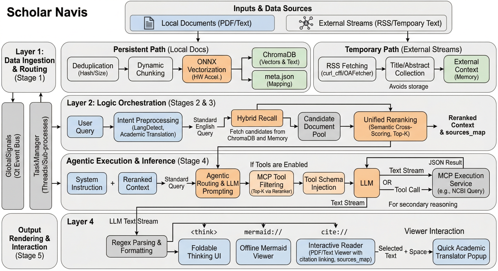
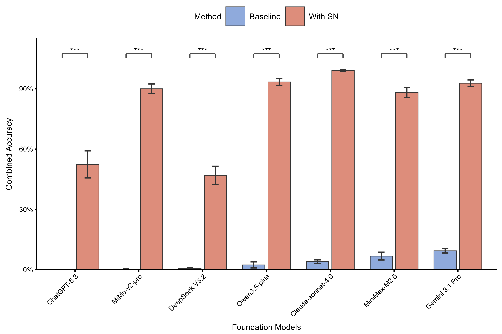
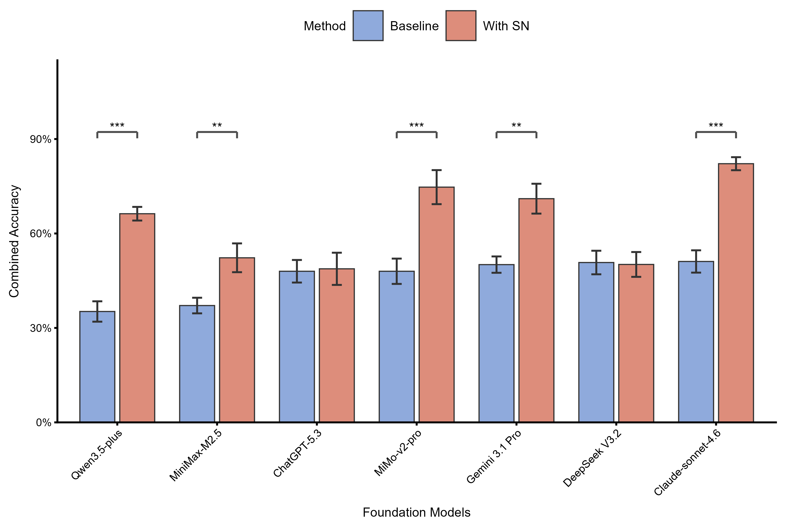
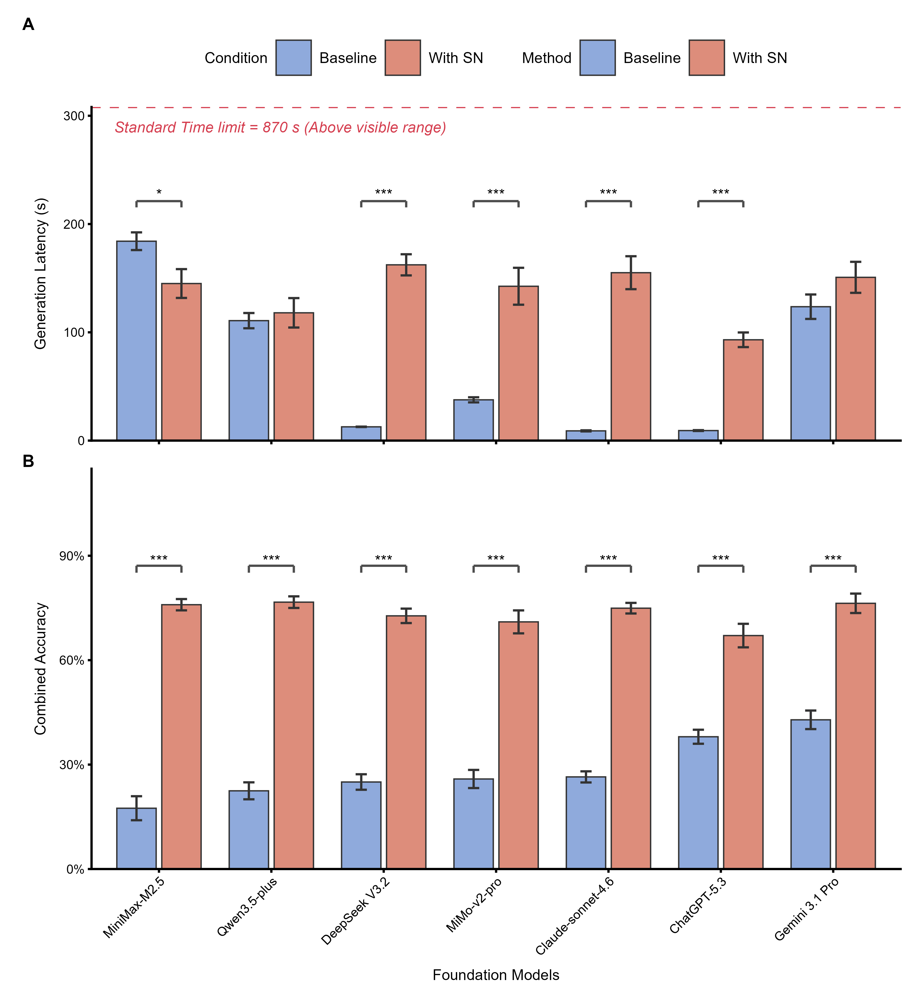

# Scholar Navis

**A Privacy-First Scientific Discovery Engine Powered by Localized Retrieval-Augmented Generation (RAG) and Academic Agent Tools**

Scholar Navis is a native desktop research engine engineered specifically for computational biology and molecular plant sciences. Designed to circumvent the critical cognitive bottleneck induced by the exponential growth of multi-omics data, this system integrates Retrieval-Augmented Generation (RAG) with specialized academic agent tools (including the Model Context Protocol [MCP] and customizable SKILLs).

Scholar Navis fundamentally resolves the pervasive "hallucination" and "knowledge conflict" phenomena inherent in Large Language Models (LLMs). By orchestrating a paradigm shift from an "opaque end-to-end generator" to a "transparent and traceable scientific reasoning scaffold," the framework ensures that all synthetic outputs are strictly anchored to verified local literature pools and authoritative biological databases.

-----

## 🏗️ System Architecture



The Scholar Navis framework operates through three rigorously engineered layers, orchestrated by a native Qt Event Bus to construct a high-fidelity data processing pipeline:

### Layer 1: Secure Data Ingestion and Vectorization

Establishing a highly secure, dual-path pipeline to guarantee absolute data privacy for unpublished or sensitive research. The persistent data path independently processes local PDF manuscripts utilizing hardware-accelerated ONNX vectorization into a localized ChromaDB instance, effectively isolating core intellectual property. Concurrently, a transient path facilitates the seamless integration of journal RSS feeds and temporary text inputs.

### Layer 2: Logical Orchestration and Inference

To mitigate linguistic and pre-training corpus biases, user inputs undergo automated language detection and are pre-translated into English. Standardized queries are processed via ChromaDB vector search and refined by local Reranker scoring. Crucially, before being dispatched to the LLM, the context is dynamically augmented through in-context prompting, strictly defined JSON schema injection, and the execution of academic agent tools (MCP and SKILLs), enforcing objective factual constraints.

### Layer 3: Dynamic Output Rendering and Interaction

Utilizing real-time regular expression (regex) parsing, this layer constructs a highly interactive academic interface. Specialized biological identifiers (e.g., NCBI TaxID, PubChem CID) are dynamically transformed into actionable hyperlinks. A dedicated "Cited Sources" module ensures rigorous citation tracking, while multidimensional heuristic follow-up prompts are generated to augment lateral scientific exploration.

-----

## 🚀 Core Capabilities & Performance Benchmarks

Scholar Navis rigorously addresses the latency-accuracy trade-off and the inherent parametric biases of highly conversational foundation models.

### 1\. Deep Hallucination Mitigation in Literature Retrieval

General-purpose LLMs frequently exhibit severe citation hallucinations, acting as autoregressive sequence predictors that prioritize fluent but flawed parametric memory. Scholar Navis utilizes strict source confinement to sever these unreliable inference paths.



**Performance:** Quantitative evaluations indicate that standalone foundation models yield literature retrieval accuracies below 10%. Integration with the Scholar Navis localized RAG and MCP architecture effectively eliminates fabricated references, significantly elevating the retrieval accuracy of top-tier model combinations (e.g., powered by Claude-sonnet-4.6, Qwen3.5-plus) to over 90% ($P \le 0.001$).

### 2\. High-Precision Biological Entity Extraction

By directing queries through MCP to authoritative databases, the framework forces the LLM's inference logic to strictly anchor onto high-fidelity biological metadata (e.g., exact amino acid sequences, interacting protein networks) prior to output generation.



**Performance:** The extraction precision for complex biological entities is significantly enhanced from a baseline of 30%–60% to a robust 60%–90%. The system notably resolves the "knowledge conflict" for highly instruction-compliant models by suppressing their ungrounded parametric memory.

### 3\. Resolving the Latency-Accuracy Trade-off

Scholar Navis empowers researchers to seamlessly synthesize critical evidence across disparate sources, drastically compressing the information acquisition cycle while guaranteeing absolute scientific rigor.



**Performance:** In end-to-end simulations of complex information-gathering tasks, traditional manual workflows required approximately 870 seconds. While standalone models are fast, their data is scientifically unreliable. Scholar Navis achieves a pragmatic equilibrium, securing highly accurate biological data in a fraction of the manual curation time without introducing statistically significant latency for optimized models.

-----

## 🔒 Data Privacy and Hardware-Bound Security

Given the extreme sensitivity of pre-published biological data, Scholar Navis is engineered with stringent security protocols:

  * **Absolute Local Processing:** All sensitive operations, including PDF parsing, embedding vector construction, and Reranker semantic filtering, are executed strictly offline on local hardware.
  * **Air-Gapping Capability:** External network requests are initiated strictly under explicit user authorization. For highly confidential institutional research, users can deploy fully localized, non-networked open-weight LLMs alongside self-hosted MCP/SKILL modules, achieving a genuinely air-gapped environment.
  * **Hardware-Bound Configuration Security:** All user configuration files (including API credentials) are encrypted utilizing OS-native security primitives and cryptographically bound to the unique hardware fingerprint of the host machine.

-----

## 🖥️ Platform Support and Running from Source

| Platform | Packaged build | Run from source |
| :--- | :--- | :--- |
| Windows 10/11 (x64) | ✅ frozen binary (`scholar_navis_win_*.zip`) | ✅ |
| Linux (x86_64) | ✅ **source bundle** (`scholar_navis_linux_*.zip`: unzip → `./run.sh`) | ✅ |
| macOS | — | ✅ (untested in CI) |

### Linux prerequisites

The PySide6 wheels are dynamically linked against the system Qt/X11 stack. Install
these with your distribution's package manager (Debian/Ubuntu names shown):

```bash
sudo apt install -y libgl1 libegl1 libglib2.0-0 libdbus-1-3 \
  libxkbcommon0 libxkbcommon-x11-0 libx11-xcb1 \
  libxcb1 libxcb-cursor0 libxcb-icccm4 libxcb-keysyms1 libxcb-randr0 \
  libxcb-render-util0 libxcb-shape0 libxcb-xkb1 libxcb-xinerama0 \
  libnss3 libnspr4 libxcomposite1 libxdamage1 libxrandr2 libxshmfence1 \
  libxtst6 libasound2 libcups2 libdrm2 libgbm1 libfontconfig1
```

The PDF and Mermaid viewers are backed by QtWebEngine and additionally need
`libnss3`, `libxcomposite`, `libxdamage`, `libxrandr` and `libxshmfence`.

If a library is missing, the application prints an actionable install command
before exiting instead of failing with a raw `ImportError`. Headless machines can
run the API server without any GUI stack:

```bash
uv run main.py --api-server
```

### NixOS

PySide6 / QtWebEngine wheels are linked against libraries at standard paths
(`/lib`, `/usr/lib`), which NixOS does not provide — a plain `uv run main.py`
fails with `ImportError: libglib-2.0.so.0: cannot open shared object file`.
Scholar Navis detects this and **relaunches itself inside the FHS environment
provided by `steam-run`**, adding the few libraries `steam-run` does not ship
(`nss`/`nspr`, `libXcomposite`, `libXtst`, `libxkbfile` and the `xcb-util*`
family):

```bash
nix profile install nixpkgs#steam-run
uv run main.py
```

The discovered library directories are cached in
`~/.cache/scholar_navis/nixos_libs.txt`.

For a permanent system-wide alternative (no `steam-run`), add the libraries to
`programs.nix-ld.libraries` in `/etc/nixos/configuration.nix` — `glib`, `libx11`,
`libxcb`, `libxkbcommon`, `libxcomposite`, `libxdamage`, `libxrandr`,
`libxshmfence`, `libxtst`, `libxkbfile`, `nss`, `nspr`, `alsa-lib`, `cups`,
`libdrm`, `mesa` — and run `sudo nixos-rebuild switch`.

### Running from source

```bash
uv sync                # Python 3.12 is required
uv run main.py
```

The Linux release asset (`scholar_navis_linux_*.zip`) is this same source tree
plus a launcher, so nothing has to be installed system-wide beyond the
prerequisites on this page:

```bash
unzip scholar_navis_linux_*.zip && cd scholar_navis
./run.sh               # = uv sync --locked --no-dev && uv run --locked --no-dev main.py
```

The first run creates `.venv/` **inside the unzipped folder** (several GB), so
unzip it somewhere with room to spare. `run.sh` refuses to guess: if `uv` is
missing it exits with code 3 and prints the install command.

### R runtime (visualization)

Charts are rendered by R (`ggplot2`). Linux distributions ship R packages
separately — install the runtime plus the core plotting packages:

```bash
sudo apt install -y r-base              # or: dnf install R / pacman -S r
Rscript -e 'install.packages(c("ggplot2","dplyr","tidyr","scales","RColorBrewer"))'
```

Settings → *R Environment* reports the detected interpreter, the version, and any
missing plotting packages with the exact `install.packages(...)` command.

### Hardware acceleration

ONNX Runtime selects the fastest **actually working** execution provider. The
device list under Settings → *AI Models Configuration → Compute Device* only
offers accelerators that were verified on this machine at startup:

| Option | Requirement | Notes |
| :--- | :--- | :--- |
| Auto Detect | — | CUDA → DirectML → ROCm → CoreML, CPU as final fallback |
| CPU | — | Always available; slowest but never fails |
| TensorRT | `onnxruntime-gpu` + TensorRT (`libnvinfer`) + CUDA 12 + cuDNN 9 | Fastest NVIDIA path. Engines are compiled on first use (tens of seconds) and cached in `models/tensorrt_cache`, so later runs start instantly |
| CUDA | `onnxruntime-gpu` + CUDA 12 + cuDNN 9 | No engine compilation; good default for NVIDIA |
| DirectML | `onnxruntime-directml` (Windows) | Works on AMD/Intel/NVIDIA without CUDA |
| ROCm | ROCm-enabled onnxruntime (Linux) | AMD GPUs |
| CoreML | macOS build | Apple Silicon |

GPUs that exist but cannot be used are still listed — greyed out and not
selectable — with the reason (e.g. *"unavailable - CUDA runtime missing"*) and a
tooltip explaining how to enable them, so the situation is visible instead of
silently degrading. `TensorRT` is never picked by *Auto Detect*: its first run
compiles engines, and hiding that cost inside "auto" would look like a hang.

`TensorRT` and `CUDA` need the matching runtime libraries; when they are absent
the application falls back to CPU, logs the reason, and *Test Compute Device*
reports exactly what is missing (results are identical, only throughput changes).
Override the engine cache location with `SCHOLAR_NAVIS_TRT_CACHE` if needed.

### Packaging

```bash
uv run build_app.py      # one entry point; the platform selects the form
```

| Platform | Form | Reason |
| :--- | :--- | :--- |
| Windows | PyInstaller `--onedir` frozen bundle | the interpreter and the dependencies travel with it |
| Linux | **source bundle** — sources + `uv.lock` + `run.sh` | the artifact holds no binary, so there is no glibc floor and no build container, the archive is MB- instead of GB-sized, and users link against their own distribution's Qt/X11 stack instead of a copy frozen into the bundle |

The Linux source bundle holds `main.py`, `src/`, `Assets/`, `plugins/`, `docs/`,
`pyproject.toml`, `uv.lock`, `requirements.txt`, `README.md`, the launcher
`run.sh` (rendered from `build_support/source_launcher.sh`), and the license files
(`LICENSE`, `LICENSES/`, `THIRD_PARTY_NOTICES.md`). Dependencies are deliberately
*not* included: `run.sh` resolves them from the locked manifest on the user's
machine. The whitelist of what goes in lives in `build_app.py::SOURCE_BUNDLE_PATHS`.

Artifacts are named `scholar_navis_<platform>_<channel>_v<version>.zip`, where
`<channel>` is `stable` or `dev` — decided solely by whether the version string
contains `-dev` (`src/core/version.py::release_channel`). The release workflow
builds Windows and Linux in parallel, uploads both to R2, and creates a GitHub
Release whose body carries the version, channel, download links and changelog.

The in-app update check fetches both channels (`/versions`) but only compares the
one the running build belongs to; `-dev` builds therefore never notify stable
users. Release notes are fetched through the site (`/changelog`), which proxies
the GitHub Release.

The Worker and the marketing page are deployed separately from this repository
(Cloudflare + R2) and are intentionally not vendored here. What this repository
owns is the **contract** between them:

* object naming — `scholar_navis_{platform}_{channel}_v{version}.zip` at the R2
  bucket root (`build_app.py` writes it, the Worker lists it by prefix);
* the endpoint paths in `src/core/version.py` (`/versions`, `/latest`, `/dl`,
  `/changelog`) and the `os` / `channel` query values the app sends;
* the release flow that keeps both in sync (`.github/workflows/build-release.yml`).

Release bodies are composed by `build_support/release_notes.py`. When
`LLM_API_KEY`, `LLM_BASE_URL` (OpenAI-compatible, e.g. `https://.../v1`) and
`LLM_MODEL` are configured (the workflow reads them from repository secrets /
variables), the commit log is summarised into an English and a Chinese section by
that model; the raw commit list is always kept in the body for verification. If
any of the three is missing, or the call fails / returns an unusable shape, the
body silently falls back to the plain commit list — an optional polish step must
never block a release.

The release workflow reads the following from repository **secrets** (and falls
back to **variables** for the two non-sensitive ones):

| Name | Required | Purpose |
| :--- | :--- | :--- |
| `R2_ACCOUNT_ID`, `R2_ACCESS_KEY_ID`, `R2_SECRET_ACCESS_KEY`, `R2_BUCKET_NAME` | yes | upload the artifacts (`build_support/r2_release.py`) |
| `LLM_API_KEY` | no | bilingual release notes; absent → commit list only |
| `LLM_BASE_URL`, `LLM_MODEL` | no | OpenAI-compatible endpoint + model for the above |

Creating the GitHub Release itself needs `contents: write`, which the workflow
requests on the `publish-release` job only.

-----

## 📚 Integrated Authoritative Databases and References

Scholar Navis deeply integrates with a consortium of international biological and chemical databases via its dynamic academic agent architecture (MCP/SKILLs) to perform real-time fact-checking.

**When utilizing Scholar Navis for academic research, please ensure appropriate citation of the following foundational database resources that power the system's factual grounding:**

  * **NCBI:** Sayers, E.W., Beck, J., Bolton, E.E., et al. (2025). Database resources of the National Center for Biotechnology Information in 2025. *Nucleic Acids Res* 53:D20–d29.
  * **UniProt:** Consortium, T.U. (2024). UniProt: the Universal Protein Knowledgebase in 2025. *Nucleic Acids Research* 53:D609–D617.
  * **PubChem:** Kim, S., Chen, J., Cheng, T., et al. (2024). PubChem 2025 update. *Nucleic Acids Research* 53:D1516–D1525.
  * **RCSB PDB:** \* Berman, H.M., Westbrook, J., Feng, Z., et al. (2000). The Protein Data Bank. *Nucleic Acids Research* 28:235–242.
      * Burley, S.K., Bhatt, R., Bhikadiya, C., et al. (2024). Updated resources for exploring experimentally-determined PDB structures and Computed Structure Models at the RCSB Protein Data Bank. *Nucleic Acids Research* 53:D564–D574.
  * **STRINGdb:** von Mering, C., Jensen, L.J., Snel, B., et al. (2005). STRING: known and predicted protein-protein associations, integrated and transferred across organisms. *Nucleic Acids Res* 33:D433–437.
  * **Ensembl Plants:** Yates, A.D., Allen, J., Amode, R.M., et al. (2021). Ensembl Genomes 2022: an expanding genome resource for non-vertebrates. *Nucleic Acids Research* 50:D996–D1003.
  * **AlphaFold:** Jumper, J., Evans, R., Pritzel, A., et al. (2021). Highly accurate protein structure prediction with AlphaFold. *Nature* 596:583–589.
  * **KEGG:** Kanehisa, M., and Goto, S. (2000). KEGG: kyoto encyclopedia of genes and genomes. *Nucleic Acids Res* 28:27–30.
  * **ChEBI:** Degtyarenko, K., de Matos, P., Ennis, M., et al. (2007). ChEBI: a database and ontology for chemical entities of biological interest. *Nucleic Acids Research* 36:D344–D350.
  * **JASPAR:** Ovek Baydar, D., Rauluseviciute, I., Aronsen, D.R., et al. (2025). JASPAR 2026: expansion of transcription factor binding profiles and integration of deep learning models. *Nucleic Acids Research* 54:D184–D193.

-----

## 📄 License

Copyright (C) 2026 Scholar Navis Studio.

Scholar Navis is free software released under the **GNU Affero General Public License v3.0**;
see [`LICENSE`](LICENSE) for the full text. You may use, study, modify and redistribute it.
Derivative works must be distributed under the same license, and if you offer the program to
users over a network, you must offer them the Corresponding Source.

This project is distributed as a desktop application. The maintainers do not operate a hosted
network service on top of it, so the additional network-source obligation of AGPL-3.0 §13 is
not triggered by an official deployment. The bundled `--api-server` mode is a local
convenience feature; it reports the source location at `GET /api/source`.

### Third-party components

The application bundles third-party open-source software, including copyleft components:
**PyMuPDF** (AGPL-3.0, or an Artifex commercial license), **PySide6 / Qt** (LGPL-3.0-only),
**chardet** (LGPL-2.1) and **certifi / orjson / tqdm** (MPL-2.0).

* The in-application **About → Licenses** dialog lists the components with functional impact
  together with their license identifiers.
* Released binaries ship `THIRD_PARTY_NOTICES.md` plus the license texts collected from each
  package under `_internal/THIRD_PARTY_LICENSES/`, and the official LGPL-3.0 / GPL-3.0 texts
  under `_internal/LICENSES/`.
* Components required at run time but **not** bundled are documented there as well — most
  notably the **R runtime** (`Rscript`) and the R packages used for visualization (ggplot2,
  dplyr, tidyr, scales, viridis, patchwork, ragg, RColorBrewer, pheatmap, ggpubr, ggrepel,
  cowplot). They are detected on the user's machine and invoked as separate processes.